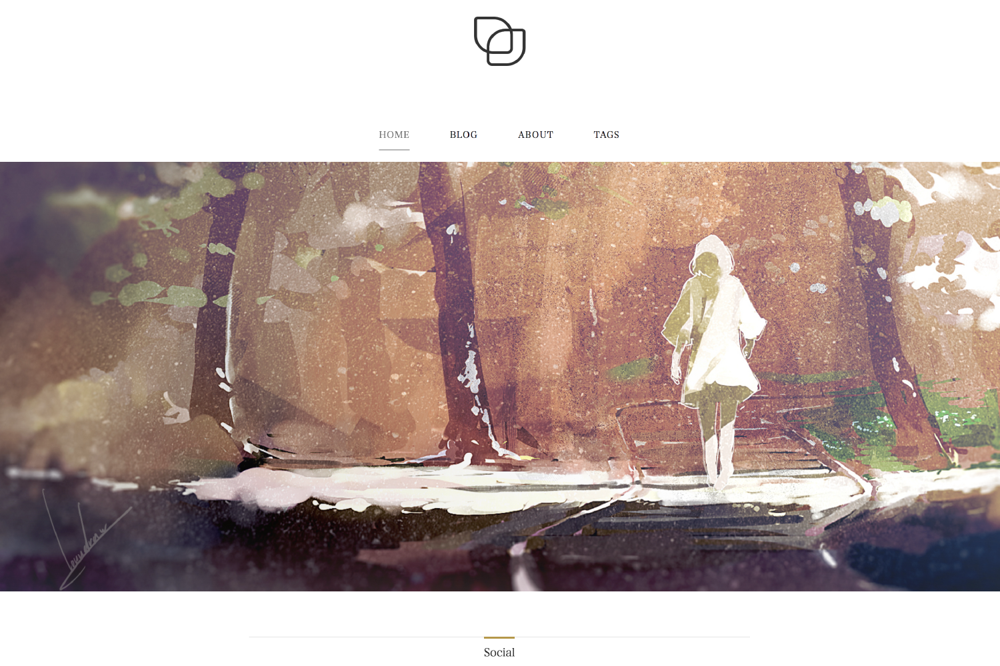

# Yuki [](https://github.com/iCyris/hugo-theme-yuki/blob/master/LICENSE)

❄️ Hugo theme yuki. She is as pure as the snow.



## Features

* Responsive
* Syntax highlighting with highlightjs
* Social links（Customize）
* Custom Page
* Support for Related Content
* Support for tags
* Google Analytics
* SCSS

## Table of Contents

* [Quick Start](#quick-start)
* [Usage](#usage)
* [Development](#development)
* [License](#license)

## Quick Start

In your hugo site directory, run:

```shell
$ mkdir themes
$ cd themes
$ git clone https://github.com/iCyris/hugo-theme-yuki
```

## Usage

Use hugo's -t hugo-theme-yuki or --theme=hugo-theme-yuki option with hugo commands. 

e.g.

```shell
$ hugo server -t hugo-theme-yuki
```

### Configuration

Please see the sample [`config.toml`](https://github.com/iCyris/hugo-theme-yuki/tree/master/exampleSite/config.toml).

### Creating Posts

Posts should generally go under a `content/posts` directory. Typically you would run:

````sh
hugo new posts/your-new-post.md
````

For posts to appear on your site, you may need `draft = false` in the post's front matter or use the `--buildDrafts` option when building.

### Creating Custom Pages

Custom pages such as an About page should preferably go under `content/pages` or be present at the root of the `content` directory.

````sh
hugo new pages/about.md
````

## Development

If you're contributing CSS changes, there are two ways: 

1. Simply make changes on `/static/scss/custom.css`, the style will be overwrited.
2. Use [SASS](https://sass-lang.com/). Directly make changes on the `*.scss` files and recompile `style.scss` or `highlight.scss`.

## License

Licensed under the MIT License. See the [LICENSE](https://github.com/iCyris/hugo-theme-yuki/blob/master/LICENSE) file for more details.


